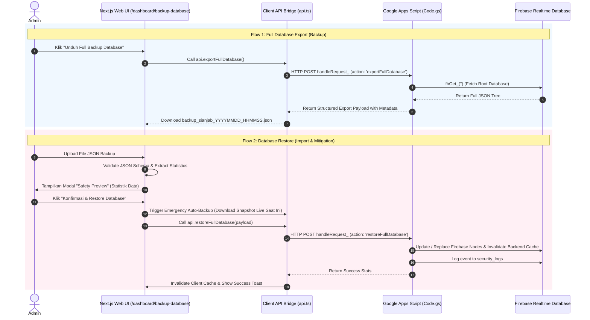

# Design Specification: Menu Backup & Restore Database Sianjab

**Date:** 2026-09-10  
**Status:** Approved  
**Author:** Antigravity AI & Admin Sianjab  

---

## 1. Executive Summary & Intent

Fitur **Backup & Restore Database** dibuat sebagai mekanisme mitigasi risiko teknis dan *human error* pada aplikasi Sianjab ABK. Fitur ini memungkinkan Superadmin (`admin`) untuk mengunduh snapshot penuh (*full export*) dari Firebase Realtime Database (mencakup data per-tahun seperti `2026`, `2027`, dll. serta data master global seperti `users`, `referensiJabatan`, `settings`, `security_logs`) dalam bentuk file `.json`. Selain itu, fitur ini menyediakan mekanisme *Restore* aman dengan validasi skema, dialog *Safety Preview*, dan *Emergency Auto-Backup* sebelum *overwrite* dilakukan.

---

## 2. Architecture & Data Flow



---

## 3. UI & UX Specifications

### 3.1. Navigation & Access Control
- **Location:** Added under "Administrasi" group in sidebar (`src/app/dashboard/layout.tsx`).
- **Route:** `/dashboard/backup-database`
- **Icon:** `💾`
- **Label:** `Backup & Restore`
- **Access Rule:** Restricted to role `admin`. Non-admin users attempting to access will be redirected to their dashboard.

### 3.2. Page Components (`/dashboard/backup-database/page.tsx`)
1. **Header System Status Card:**
   - Database Connection Status (Live indicator).
   - Info total node dan stempel waktu backup terakhir dari `security_logs`.
2. **Export Card (Unduh Backup):**
   - Rincian cakupan data: Folder tahun (`2026`, `2027`, dll.) & Master global (`users`, `referensiJabatan`, `settings`, `security_logs`).
   - Action Button: `💾 Unduh Full Backup Database (.json)` dengan spinner state saat fetching data.
3. **Import & Restore Card:**
   - File drag-and-drop zone (`.json` format).
   - Validation feedback (Menampilkan status file valid / invalid).
   - Button: `🔍 Analisis File Backup`.
4. **Safety Preview Modal:**
   - Menampilkan stempel waktu backup, pembuat backup, dan statistik item (jumlah OPD, Jabatan, ABK per tahun, serta User).
   - Tombol konfirmasi ganda dengan *Emergency Snapshot Download* otomatis.
5. **Security & Audit Logs Table:**
   - Menampilkan 5 riwayat aktivitas `BACKUP_EXPORT` dan `RESTORE_DATABASE` terakhir.

---

## 4. Backend & API Specifications

### 4.1. Google Apps Script (`gas/Code.gs`)
- **Action `exportFullDatabase`**:
  - Mengambil root node Firebase Realtime Database.
  - Membungkus data dengan metadata:
    ```json
    {
      "app": "SIANJAB_ABK",
      "version": "1.0",
      "timestamp": "2026-09-10T14:55:00.000Z",
      "exportedBy": "Nama Admin (NIP)",
      "data": { ... }
    }
    ```
- **Action `restoreFullDatabase`**:
  - Menerima payload JSON backup terstruktur.
  - Memvalidasi payload: Harus memiliki node `data` dan kunci minimal.
  - Menuliskan data kembali ke Firebase Realtime Database per node utama.
  - Memanggil `invalidateAllCaches_()`.
  - Mencatat audit log ke `security_logs` dengan aksi `RESTORE_DATABASE`.
- **Deployment ID & Rules:**
  - Deployment ID wajib: `AKfycbxbuHWzaPOMyEemDcUsYCboqWkE5g1Lq-FFKwA5eNyBbamd41686X1a2m7OIFI-h-yLWw` menggunakan flag `-i`.

### 4.2. Client API Bridge (`src/lib/api.ts`)
- `exportFullDatabase()`: Mengirim request ke GAS dan mengembalikan payload backup.
- `restoreFullDatabase(payload)`: Mengirim payload restore ke GAS, didaftarkan pada `writeActions` untuk pembersihan cache otomatis di client.

---

## 5. Error Handling & Mitigation Strategy

- **Tanpa Fallback Palsu**: Jika JSON tidak valid, error ditampilkan secara jelas (*explicit exception*).
- **Emergency Auto-Backup**: Sebelum restore dijalankan, snapshot keadaan live saat ini diunduh secara otomatis ke browser admin (`auto_backup_sebelum_restore_<timestamp>.json`).
- **Cache Invalidation**: Seluruh cache client (`sessionStorage` + `memoryCache`) dan GAS CacheService terhapus total setelah restore.
